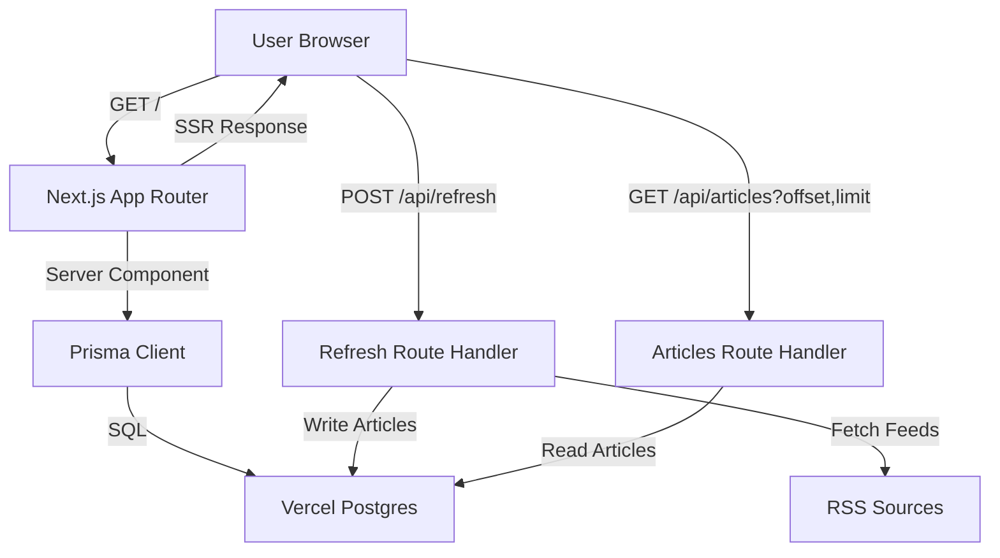

# System Design Doc – NewsFeed App

## 1. Problem Statement
Deliver a modern newsfeed web app that aggregates curated RSS and YouTube sources into a clean UI, supports manual refreshes, and paginates cached stories without overloading upstream feeds.

## 2. Goals
- Aggregate 15+ tech RSS feeds plus curated YouTube channels on demand, deduplicate, and persist results.
- Serve a responsive, minimal UI with navigation, article cards, and smooth pagination.
- Allow manual “Fresh” refresh that re-crawls sources, overwriting the cache.
- Deploy on Vercel with custom domain support and daily/cron refresh via HTTP.
- Keep codebase modular (Next.js App Router) and easily extensible for future features.

## 3. Non-Goals
- Real-time streaming or push notifications.
- User accounts, personalization, or per-user state.
- Automated background workers running permanently (Vercel serverless doesn’t support).
- Advanced analytics, search, or offline capabilities.
- AI-based summarization or classification of feeds.

## 4. High-Level Architecture


## 5. Detailed Design
- **Frontend (Next.js App Router)**
  - `src/app/page.tsx` renders server-side and pulls initial cached articles.
  - `src/components/news-feed-client.tsx` manages client state, infinite scroll, and handles the Fresh button.
  - Article cards show title, snippet, source label, fallback logos, and timestamps.

- **Data Aggregation**
  - `src/lib/fetch-articles.ts`:
    - `collectFeedArticles()` requests each RSS/YouTube feed using `rss-parser`, normalises results (articles vs. videos), truncates to 64 entries.
    - `refreshArticleStore()` overwrites the DB with new records via Prisma.
    - `fetchLatestArticles()` pages cached rows through Prisma for API/SSR responses.

- **Persistence (Prisma + Vercel Postgres)**
  - `src/lib/db.ts` exports a singleton Prisma client (`PrismaClient`).
  - `prisma/schema.prisma` defines the `Article` model mapped to `articles` with indices on `published_at`.
  - `replaceArticles()` uses transactional `deleteMany` + `createMany` to refresh the cache atomically.
  - `getArticlesPage()` paginates via `findMany(skip, take)`; `getLastFetchedAt()` returns cache freshness.

- **API Routes**
  - `POST /api/refresh`: triggers `refreshArticleStore()`; used by Fresh button or scheduled cron.
  - `GET /api/articles`: returns paginated cached articles (offset/limit, metadata).
  - Both routes run server-side with Prisma.

- **Deployment & Ops**
  - Vercel project with env vars: `POSTGRES_URL`, `DATABASE_URL`, `PRISMA_DATABASE_URL`.
  - `postinstall` runs `prisma generate`; `prisma db push` applied manually or via CI.
  - Cron job (Vercel Scheduler) POSTs `/api/refresh` to keep cache warm.
  - Custom domain mapping via Vercel settings.
  - Postgres connection pooling handled by Prisma clients.

- **Caching Strategy**
  - Cache persists in Postgres; Fresh button repopulates immediately.
  - Infinite scroll uses cached data to avoid redundant feed fetches on the client.

## 6. Data Model (Prisma Schema)
```prisma
model Article {
  id              String   @id
  title           String
  snippet         String
  link            String
  imageUrl        String?  @map("image_url")
  publishedAt     DateTime? @map("published_at")
  sourceId        String   @map("source_id")
  fetchedAt       DateTime @map("fetched_at")
  mediaType       String   @map("media_type") @default("article")
  videoId         String?  @map("video_id")
  channelId       String?  @map("channel_id")
  durationSeconds Int?     @map("duration_seconds")

  @@map("articles")
  @@index([publishedAt(sort: Desc)], map: "idx_articles_published_at")
}
```

## 7. API & Interface Contracts
- `POST /api/refresh`
  - Response `{ count: number, fetchedAt: string }` or `{ error }` with 500.
- `GET /api/articles?offset=0&limit=12`
  - Response `{ articles: FeedArticle[], hasMore: boolean, lastFetchedAt: string|null, total: number }`.
- `FeedArticle`: `{ id, title, snippet, link, imageUrl?, publishedAt?, sourceId, mediaType, videoId?, channelId?, durationSeconds? }`.

## 8. Scaling & Performance Considerations
- Data volume capped at 64 articles per refresh; low write load.
- Postgres handles read load; Prisma pooling via Accelerate or pgBouncer if needed.
- Refresh is heavy (RSS crawl) but user-driven or cron-based; run rate-limited.
- YouTube ingestion uses channel RSS feeds (15-minute cache) to avoid API quotas; store channel/video metadata for future filtering.
- Future: incremental refresh per source, or queue-based workers if cadence increases.

## 9. Potential Improvements & Trade-offs
- **Pros**
  - Simple architecture; SSR is SEO-friendly.
  - Prisma simplifies schema/migrations; Postgres ensures durability.
  - Manual refresh avoids hitting feeds on every page load.
- **Cons**
  - Fresh button blocks until full RSS crawl completes.
  - Cron frequency constrained by upstream rate limits.
  - No deduping beyond GUID; feed changes may duplicate updates.
- **Future Enhancements**
  - Incremental refresh per source / queue worker.
  - Progress indicator or optimistic UI during Refresh.
  - `next/image` remote loader for better thumbnail optimisation.

## 10. Testing & Monitoring
- Commands: `npm run refresh-feeds`, `npm run build`, `npm run dev`.
- Linting: `npm run lint` (current warning about `` remains by design).
- Observability: log refresh durations/errors; integrate Vercel monitoring.

## 11. Deployment Checklist
- Ensure `.env.local` mirrors Vercel env vars (`POSTGRES_URL`, `DATABASE_URL`, `PRISMA_DATABASE_URL`).
- Run `prisma db push` after schema changes.
- `postinstall` → `prisma generate` ensures client freshness on deploy.
- Configure Vercel Scheduler to POST `/api/refresh` daily.
- Set custom domain & SSL via Vercel settings.
